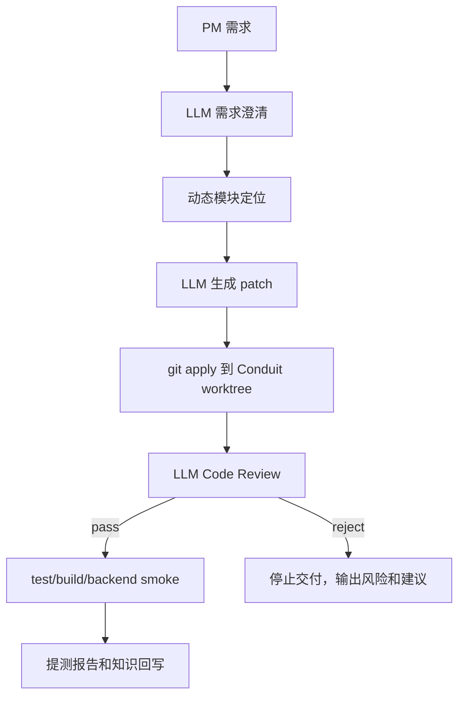

# LLM Code Review 流程设计

## 1. 参考调研

本次设计参考了几个成熟 AI code review 产品的公开说明：

- GitHub Copilot Code Review：支持 PR 或本地变更审查，输出 review comments 和 suggested changes；官方说明 Copilot review 是 comment review，不等同于人工 approval，也不会自动阻塞合并。它还支持 repository/path 级 custom instructions。
- GitLab Duo Code Review：以 MR title、description、变更前文件内容、diff、filenames、custom instructions 作为模型上下文；大 MR 会因为上下文窗口问题降级为只带 diff 的重试；官方建议拆小 MR、排除无关上下文。
- CodeRabbit：强调 automated/context-aware review，能在 PR、IDE、CLI 中审查，目标是发现 bugs、执行标准并结合团队反馈。
- Qodo Git Integration：强调 PR 级 review、变更摘要、改进建议、潜在问题检测和降低 review blocker。

参考链接：

- https://docs.github.com/en/copilot/how-tos/use-copilot-agents/request-a-code-review/use-code-review
- https://docs.gitlab.com/user/gitlab_duo/code_review/
- https://docs.coderabbit.ai/
- https://docs.qodo.ai/v1/qodo-merge

## 2. 设计取舍

本项目不是普通 PR bot，而是 AI 生成代码后的交付链路，所以 review 需要做成质量闸门。

采用规则：

```text
1. review 输入必须包含需求澄清、方案约束、模块定位、代码生成结果、diff 和相关文件上下文。
2. review 输出必须是结构化 JSON。
3. verdict 只有 pass/reject。
4. pass 才能继续进入 test/build/backend smoke。
5. reject 直接停止后续验证，并返回风险点和建议修改方向。
6. review 不关注纯风格偏好，优先关注功能正确性、边界条件、回归风险、安全/数据风险、测试缺口、是否越界修改。
```

## 3. Workflow 位置

新的代码生成流程：

```text
需求澄清
-> 方案拆解
-> 创建 Conduit worktree
-> 模块定位
-> 代码生成并应用 patch
-> LLM Code Review
   -> pass: 进入测试/构建/backend smoke
   -> reject: 停止，输出风险和修改方向
-> 测试计划
-> verification
-> delivery packaging
-> knowledge write
```

Mermaid：



## 4. Review 输入

`code_review` stage 使用：

```text
requirementStage.data
planStage.data
moduleStage.data
codeStage.data
code-review-diff.patch
相关文件上下文
```

相关文件上下文包括：

```text
codeStage.data.touchedFiles
moduleStage.data.editBoundary
moduleStage.data.readOnlyFiles
```

这样避免只看 diff 的盲区，也控制上下文规模。

## 5. Review 输出

结构化文件：

```text
code-review.json
code-review-raw.json
code-review-diff.patch
```

JSON schema：

```json
{
  "verdict": "pass | reject",
  "summary": "一句话总结",
  "changedScope": ["代码变动范围"],
  "estimatedImpact": "预估影响",
  "risks": ["风险点；pass 时可为空或低风险"],
  "suggestions": ["建议修改方向；pass 时可为空"],
  "requiredChanges": ["reject 时必须修改项；pass 时为空"]
}
```

## 6. pass 行为

当 verdict 为 `pass`：

```text
code_review.status = completed
workflow 继续执行 test_planning 和 verification
delivery-report.md 记录 review 结论、范围、影响、风险和建议
```

pass 示例：

```json
{
  "verdict": "pass",
  "summary": "变更只影响热门标签空状态渲染，未改变数据流和后端接口。",
  "changedScope": ["frontend/src/components/PopularTags/PopularTags.jsx"],
  "estimatedImpact": "低风险，仅影响 tags 为空时的展示文案。",
  "risks": [],
  "suggestions": [],
  "requiredChanges": []
}
```

## 7. reject 行为

当 verdict 为 `reject`：

```text
code_review.status = blocked
workflow.status = rejected_by_code_review
不继续执行 test/build/backend smoke
delivery-report.md 记录风险点和建议修改方向
```

reject 示例：

```json
{
  "verdict": "reject",
  "summary": "变更修改了无关登录组件，超出模块边界。",
  "changedScope": ["frontend/src/components/PopularTags/PopularTags.jsx", "frontend/src/routes/Login.jsx"],
  "estimatedImpact": "可能引入登录页回归。",
  "risks": ["越界修改", "需求无关回归风险"],
  "suggestions": ["仅保留 PopularTags 空状态变更", "重新生成 patch"],
  "requiredChanges": ["移除 Login.jsx 修改"]
}
```

## 8. 后续增强

下一步应该把 reject 接到模型修复循环：

```text
code_review reject
-> 把 review 风险和 requiredChanges 交给 patch repair agent
-> 生成修复 patch
-> 再次 code_review
```

当前版本先实现一票否决和结构化输出，不自动修复 review reject。
