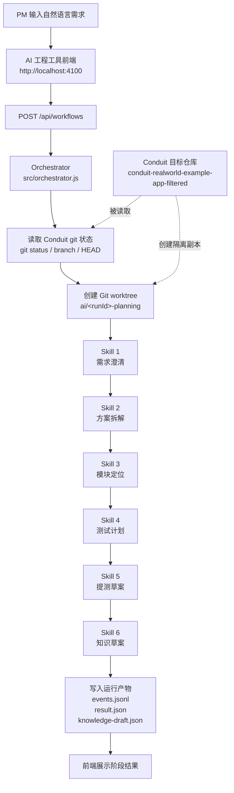
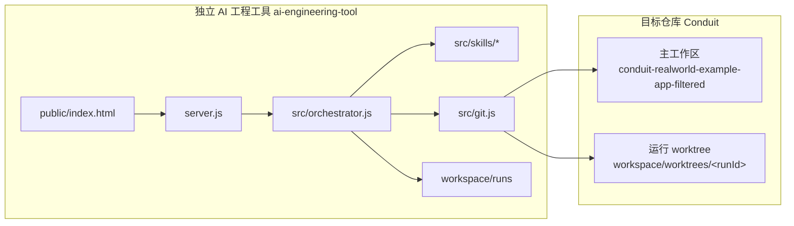
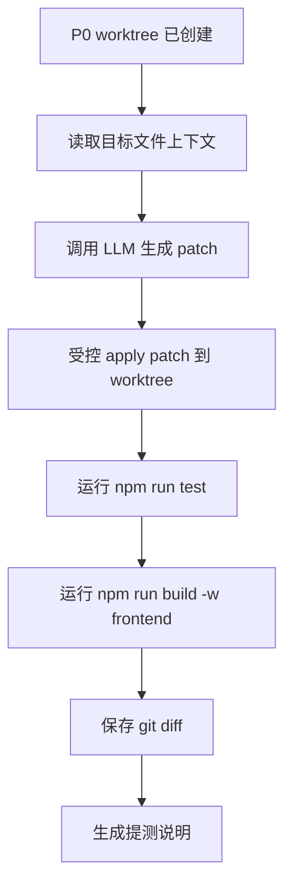

# P0 工作流图

## 当前定位

P0 不是完整代码生成 Agent，还没有调用 LLM，也没有自动修改 Conduit 业务代码。

P0 的目标是先跑通独立 AI 工程工具的最小链路：

```text
独立前端输入需求
  -> 独立后端 API
  -> Orchestrator
  -> 规则型 Skills
  -> 读取 Conduit git 状态
  -> 创建 Conduit worktree/branch
  -> 写入 workflow artifacts
```

## 总体流程



## 组件边界



## 时序图

```mermaid
sequenceDiagram
    participant PM as PM
    participant UI as 前端页面
    participant API as Node API
    participant ORCH as Orchestrator
    participant GIT as Git 工具
    participant SKILL as Skills
    participant WS as Workspace
    participant C as Conduit Repo

    PM->>UI: 输入需求
    UI->>API: POST /api/workflows
    API->>ORCH: runWorkflow(requirement)
    ORCH->>WS: 创建 run 目录
    ORCH->>GIT: 读取目标仓库状态
    GIT->>C: git status / branch / HEAD
    C-->>GIT: repoStatus
    GIT-->>ORCH: repoStatus
    ORCH->>GIT: 创建 worktree 和 run branch
    GIT->>C: git worktree add -b ai/&lt;runId&gt;-planning
    GIT-->>ORCH: worktree path
    ORCH->>SKILL: 需求澄清
    SKILL-->>ORCH: clarification stage
    ORCH->>SKILL: 方案拆解
    SKILL-->>ORCH: plan stage
    ORCH->>SKILL: 模块定位
    SKILL-->>ORCH: module stage
    ORCH->>SKILL: 测试计划 / 提测草案 / 知识草案
    SKILL-->>ORCH: remaining stages
    ORCH->>WS: 写 events.jsonl / result.json / knowledge-draft.json
    ORCH-->>API: workflow result
    API-->>UI: JSON result
    UI-->>PM: 展示 runId、worktree、阶段结果
```

## P0 已完成能力

- AI 工程工具作为独立项目运行。
- 前端页面可输入 PM 需求。
- 后端 API 可创建 workflow run。
- Orchestrator 可串联多个 skill。
- 工具可读取真实 Conduit git 状态。
- 工具可创建 Conduit 的 git worktree 和 run branch。
- 工具可将运行过程写入本地 artifacts。
- 前端可展示阶段结果。

## P0 未完成能力

- 未调用 LLM。
- 未自动生成代码 patch。
- 未自动修改 Conduit 业务代码。
- 未运行 worktree 内测试。
- 未创建 PR。
- 未实现阶段暂停、修改、重放。

## P1 目标

P1 应在 P0 基础上补上真实代码修改闭环：



