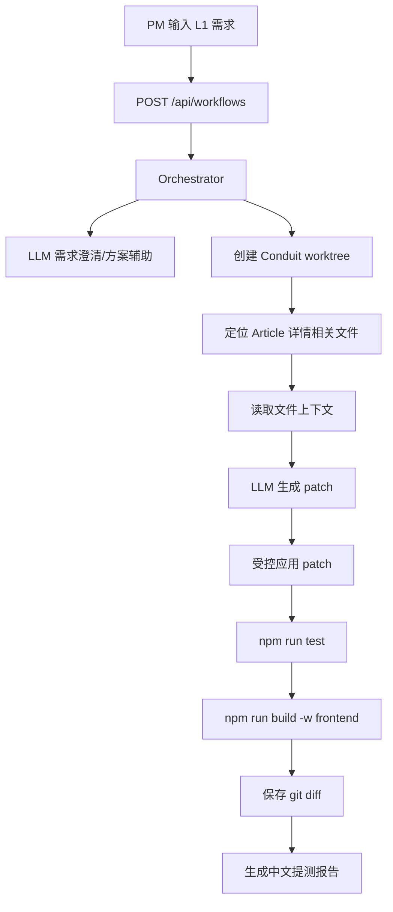

# P1 实施计划：模型接入与真实代码修改闭环

## 目标

P1 在 P0 独立工具和 git worktree 管理能力基础上，补齐第一条真实代码修改链路。

目标需求：

```text
文章详情页新增字数统计：在文章正文下方显示“本文共 XXX 字，预计阅读 X 分钟”，前端基于 Article.body 计算。
```

P1 完成后，AI 工程工具应能：

1. 调用可配置的 OpenAI-compatible Chat Completions 模型。
2. 在 Conduit worktree 中生成并应用代码修改。
3. 运行自动化验证。
4. 保存 diff、测试结果、模型调用记录和提测说明。

## 模型接入

模型调用使用 OpenAI-compatible Chat Completions API，默认仍兼容火山方舟，也可切换到 DeepSeek：

```text
LLM_BASE_URL=https://api.deepseek.com
LLM_MODEL=deepseek-chat
```

安全要求：

- API key 不写入源码。
- API key 不写入报告。
- API key 通过环境变量或本地 `.env` 传入：

```bash
LLM_API_KEY=...
LLM_BASE_URL=https://api.deepseek.com
LLM_MODEL=deepseek-chat
```

旧的 `ARK_API_KEY`、`ARK_MODEL`、`ARK_BASE_URL` 仍可使用，DeepSeek 专用别名 `DEEPSEEK_API_KEY`、`DEEPSEEK_MODEL`、`DEEPSEEK_BASE_URL` 也可使用。

## P1 工作流



## 技术策略

为了保证 P1 可稳定演示，代码修改采用“模型生成 + 工具校验 + 受控写入”的方式：

- LLM 负责生成实现方案和 patch 草案。
- 工具层只允许修改 P1 允许的文件边界。
- patch 应用于 run worktree，不修改 Conduit 主工作区。
- 应用后运行测试和构建。
- 失败时保存失败日志，后续 P2 再接自动修复循环。

## 允许修改范围

P1 首个需求仅允许修改：

```text
frontend/src/routes/Article/Article.jsx
frontend/src/helpers/articleStats.js
frontend/src/helpers/articleStats.test.js
```

不允许修改：

```text
backend/**
frontend/src/context/**
frontend/src/services/**
package.json
package-lock.json
```

## 验收标准

P1 完成条件：

- 独立 AI 工程工具仍运行在 `http://localhost:4100`。
- workflow 调用模型成功，记录 tokens/latency。
- Conduit worktree 中产生真实代码 diff。
- `npm run test` 通过。
- `npm run build -w frontend` 通过。
- run 目录包含：
  - `events.jsonl`
  - `result.json`
  - `knowledge-draft.json`
  - `model-calls.jsonl`
  - `changes.patch`
  - `test-output.txt`
  - `build-output.txt`
  - `delivery-report.md`

## 与评分标准对齐

- 三端齐备：独立前端、Node 后端、AI 编排层。
- 真实接入 Conduit：所有代码修改发生在 Conduit worktree。
- 自动化测试兜底：运行测试和构建。
- 过程留痕：保存模型调用、事件日志、diff 和提测报告。
- 避免套壳：模型只负责智能生成，git、patch、测试、报告由工程工具控制。
