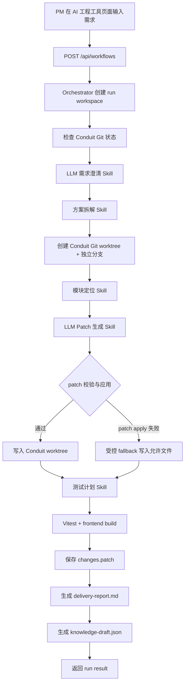
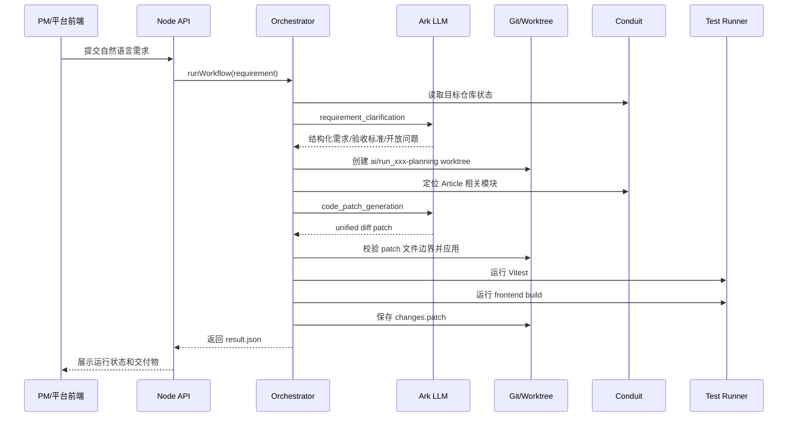
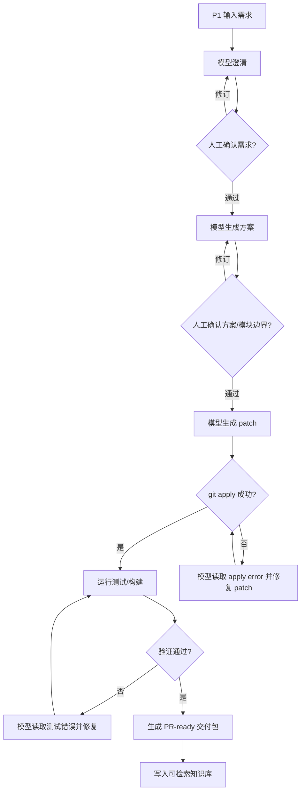

# P1 工作流分析：模型接入后的端到端闭环

## 1. P1 定位

P1 的目标不是把 AI 工程工具写进 Conduit，而是让独立项目 `ai-engineering-tool` 能够对 Conduit 目标仓库执行一次真实、可验证、可追踪的增量需求交付。

本阶段已经跑通的最小闭环是：

```text
PM 输入需求
-> 模型需求澄清
-> 方案拆解
-> Conduit 模块定位
-> 创建 Git worktree
-> 模型生成 patch
-> 工具受控写入 Conduit
-> 自动化测试和构建
-> 生成 diff、提测报告、知识草案
```

对应成功运行：

```text
runId: run_20260521065432796_4n4ay4
targetRepo: conduit-realworld-example-app-filtered
branch: ai/run_20260521065432796_4n4ay4-planning
status: completed_with_gates
```

## 2. 总体工作流



## 3. 调用时序



## 4. 阶段分析

### 4.1 入口层

入口由 `server.js` 暴露：

- `POST /api/workflows`：提交需求并触发一次完整工作流。
- `GET /api/workflows/:runId`：查询工作流结果。
- `GET /api/target/status`：查看目标 Conduit 仓库状态。

当前入口已经满足 P1 的最小使用方式，但还不是完整产品化平台。后续 P2 需要把每个 stage 的状态、日志、人工确认点都前端化。

### 4.2 Orchestrator 层

`src/orchestrator.js` 是 P1 的主控：

```text
runWorkflow
-> ensureRunWorkspace
-> getRepoStatus
-> clarifyRequirement
-> planSolution
-> createPlanningWorktree
-> locateModules
-> generateAndApplyPatch
-> planTests
-> runVerification
-> packageDelivery
-> writeKnowledge
```

这个设计的优点是每个阶段都有明确输入输出，并且所有阶段事件都会写入 `events.jsonl`。这符合项目评价里对“过程可人工介入、可追踪、可复盘”的要求。

当前不足是 stage 之间仍然是线性执行，人工介入点只体现在报告和数据结构里，还没有实现暂停、修改、恢复执行。

### 4.3 模型层

P1 已经接入火山方舟 Chat Completions：

```text
ARK_BASE_URL=https://ark.cn-beijing.volces.com/api/v3
ARK_MODEL=ep-20260514110933-mzh58
```

API key 通过环境变量传入，不写入源码、不写入文档、不写入运行产物。

成功运行中有两次真实模型调用：

```text
requirement_clarification:
  status: 200
  total_tokens: 863

code_patch_generation:
  status: 200
  total_tokens: 3480
```

模型调用日志保存在：

```text
ai-engineering-tool/workspace/runs/run_20260521065432796_4n4ay4/model-calls.jsonl
```

这说明 P1 不是纯脚本改代码，模型已经参与了需求结构化和代码 patch 生成。

### 4.4 Git 管理层

P1 使用两层 Git 管理：

第一层是项目总仓库：

```text
end2endProject
```

其中包含：

- 独立 AI 工程工具 `ai-engineering-tool`
- 作为普通目录纳入管理的 Conduit `conduit-realworld-example-app-filtered`

第二层是每次运行时的隔离工作区：

```text
ai-engineering-tool/workspace/worktrees/run_xxx
```

每次 workflow 创建独立分支：

```text
ai/run_20260521065432796_4n4ay4-planning
```

这种方式的价值是：

- AI 生成代码不会直接污染主目录。
- 每次运行都有独立 diff。
- 后续可以把 worktree 分支升级为 PR 创建来源。
- 平台可以保留每次需求的完整运行证据。

当前需要注意的是，Conduit 已经作为普通目录提交到总仓库，因此 P1 阶段不再跟踪原始 Conduit upstream 更新。这符合当前用户决策，但 P2/P3 如果需要同步上游，需要重新设计 vendor/upstream 管理策略。

### 4.5 模块定位层

P1 的模块定位结果聚焦文章详情页：

```text
frontend/src/routes/Article/Article.jsx
frontend/src/services/getArticle.js
frontend/src/components/ArticleMeta/ArticleMeta.jsx
backend/controllers/articles.js
backend/routes/articles.js
backend/models/Article.js
```

实际编辑边界被收敛到前端：

```text
frontend/src/routes/Article/Article.jsx
frontend/src/helpers/articleStats.js
frontend/src/helpers/articleStats.test.js
```

这和需求一致：字数统计完全基于 `Article.body`，不需要修改后端 API、数据库 schema 或认证逻辑。

### 4.6 代码生成层

P1 的代码生成由 `src/skills/patchGenerator.js` 负责。

核心策略：

- 把当前 `Article.jsx` 内容放进 prompt。
- 要求模型只输出 unified diff。
- 限制可修改文件白名单。
- 保存模型原始输出到 `model-generated.patch`。
- 对 patch 中的文件路径做边界校验。
- 使用 `git apply --whitespace=fix` 应用 patch。

本次运行中的真实情况是：

```text
模型生成了 patch，但 patch 未能直接 git apply。
工具记录 patch-apply-error.txt。
随后在允许文件边界内执行 controlled fallback。
```

因此 P1 的状态应准确表述为：

```text
模型参与生成代码方案，工具完成受控落地；尚未达到模型 patch 100% 自修复应用。
```

这是 P2 必须优先补齐的能力：当 patch 应用失败时，把错误、目标文件上下文和原 patch 再交给模型进行二次修复，而不是使用固定 fallback。

### 4.7 验证层

P1 的验证由 `src/verification.js` 负责：

```text
1. 确保 worktree 具备 node_modules。
2. 运行 Vitest。
3. 运行 npm run build -w frontend。
4. 保存 git diff 到 changes.patch。
```

成功结果：

```text
Test Files  4 passed
Tests       15 passed
frontend build passed
changes.patch diffBytes: 2876
```

当前验证可以证明“代码可提测”，但还没有覆盖浏览器端人工验收或自动 E2E。P2 应增加 Playwright 检查文章详情页是否真实展示统计文案。

### 4.8 交付物层

每次 run 的核心产物位于：

```text
ai-engineering-tool/workspace/runs/run_20260521065432796_4n4ay4/
```

关键文件：

```text
result.json
events.jsonl
model-calls.jsonl
model-generated.patch
patch-apply-error.txt
changes.patch
test-output.txt
build-output.txt
delivery-report.md
knowledge-draft.json
dependency-bootstrap.json
```

这些产物使得一次 AI 交付可以被追踪：

- 需求怎么被理解。
- 模型调用是否成功。
- 修改了哪些文件。
- 为什么 patch 没有直接应用。
- 测试和构建是否通过。
- 可以沉淀什么知识。

## 5. 与项目评价要求的对应关系

| 评价要求 | P1 当前状态 | 说明 |
| --- | --- | --- |
| 独立 AI 工程工具 | 已满足 | 工具位于 `ai-engineering-tool`，不写入 Conduit 内部 |
| 在 Conduit 上增量实现 | 已满足 | 本次需求修改 Conduit 文章详情页 |
| 需求澄清 | 已初步满足 | 已调用模型生成用户故事、验收标准、开放问题 |
| 方案拆解 | 已初步满足 | 当前是规则化方案，后续应模型化并支持人工修订 |
| 模块定位 | 已初步满足 | 已定位真实文件，但仍偏规则化 |
| 代码生成 | 部分满足 | 模型生成 patch，工具受控落地；缺少 patch 自修复 |
| 自动化测试 | 已初步满足 | Vitest + frontend build 已通过 |
| 代码部署 | 未满足 | P1 只到可提测，不做部署 |
| 人工介入 | 设计中，未完整实现 | 目前没有 stage pause/resume |
| 知识回写 | 已初步满足 | 生成 `knowledge-draft.json`，但还未进入可检索知识库 |

## 6. P1 的关键结论

P1 已经证明：

```text
独立 AI 工程工具可以在 Conduit 上完成一次真实前端增量需求：
模型理解需求 -> 创建隔离分支 -> 写入代码 -> 跑测试/构建 -> 输出可提测产物。
```

同时 P1 也暴露出三个核心短板：

```text
1. patch 应用失败后还不是模型自修复闭环。
2. 人工介入节点还没有做成产品能力。
3. 知识回写还只是文件草案，没有进入后续需求可复用的检索机制。
```

## 7. P2 建议工作流

P2 应在 P1 基础上升级为“可人工介入的模型修复闭环”：



P2 的优先级建议：

```text
P2-1: patch apply 失败后的模型二次修复。
P2-2: 测试失败后的模型修复循环。
P2-3: 前端 stage 审批和修订入口。
P2-4: 知识库索引，后续需求可检索历史模块边界和实现模式。
P2-5: PR 创建或本地分支提交能力。
```
