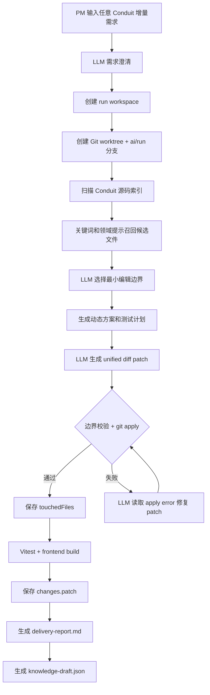

# P2 通用需求处理框架

## 1. 本阶段目标

P2 的目标是把 P1 的“文章字数统计单点样例”扩展为“面向 Conduit 的通用需求处理框架”。

本阶段暂不做可交互人工节点，先补齐后端编排能力：

```text
任意 PM 需求
-> 模型需求澄清
-> 仓库索引
-> 动态模块定位
-> 动态编辑边界
-> 模型 patch 生成
-> patch 失败后的模型修复循环
-> 测试/构建
-> diff、提测报告、知识草案
```

这里的“通用”不是无限制修改任意文件，而是在 Conduit 前后端源码范围内，由需求驱动选择边界，再让模型在受控边界中修改代码。

## 2. P1 到 P2 的关键变化

| 能力 | P1 | P2 |
| --- | --- | --- |
| 需求类型 | 固定文章详情页字数统计 | 面向 Conduit 前后端源码的通用需求 |
| 模块定位 | 固定文件列表 | 仓库索引 + 领域提示 + 模型选择编辑边界 |
| 编辑边界 | 固定 3 个文件 | 动态 `editBoundary` + 允许新增文件目录 |
| patch 生成 | 固定 prompt | 使用需求、方案、模块上下文生成通用 patch |
| patch 失败 | 受控 fallback 写死实现 | 模型读取错误后最多修复两轮 |
| 交付报告 | 文章页专用验收 | 通用变更文件和通用验收提示 |
| 知识回写 | 固定前端增强模式 | 记录动态模块、领域和边界 |

## 3. P2 工作流



## 4. 仓库索引

新增模块：

```text
src/repoIndex.js
```

索引范围：

```text
frontend/src
backend
```

默认排除：

```text
.git
node_modules
dist/build
coverage
backend/migrations
backend/seeders
```

索引会基于 PM 需求识别领域：

```text
article
comment
profile
auth
settings
tag
feed
```

然后对源码文件打分，召回候选文件。例如：

```text
需求：评论列表增加删除确认
候选：CommentsSection.jsx、comments controller、comments routes、comment services
```

```text
需求：热门标签为空时显示占位文案
候选：PopularTags.jsx、TagButton.jsx、tags route/service
```

## 5. 动态模块定位

改造文件：

```text
src/skills/moduleLocator.js
```

模块定位现在输出：

```json
{
  "editBoundary": ["可编辑的既有文件"],
  "readOnlyFiles": ["只读上下文文件"],
  "relatedTests": ["已存在的相关测试"],
  "allowedNewFilePrefixes": ["允许新增文件的目录前缀"],
  "noEditAreas": ["禁止修改区域"],
  "locatedBy": "model_with_index"
}
```

如果模型调用失败，模块定位会退回启发式索引结果：

```text
locatedBy: heuristic_after_model_failure
```

这个 fallback 是为了让框架可运行；真实交付仍应优先依赖模型收敛编辑边界。

## 6. 动态代码生成

改造文件：

```text
src/skills/patchGenerator.js
```

P2 代码生成 prompt 不再包含“文章字数统计”的固定需求，而是组合：

```text
需求澄清结果
方案约束
动态 editBoundary
允许新增文件目录
相关文件上下文
上一次 patch 失败错误
```

patch 校验规则：

```text
1. 既有文件必须在 editBoundary 或 relatedTests 内。
2. 新增文件必须位于 allowedNewFilePrefixes。
3. 禁止修改 node_modules、dist/build、package.json、package-lock.json、.env。
4. 禁止修改 backend/migrations 和 backend/seeders。
5. patch 必须真实触达文件，否则阻断。
```

## 7. patch 修复循环

P1 的固定 fallback 已移除。

P2 的策略：

```text
第 1 次：模型生成 model-generated.patch
失败后：保存 patch-apply-error-0.txt
第 2 次：模型读取失败 patch 和错误，生成 model-repaired-1.patch
再次失败：保存 patch-apply-error-1.txt
第 3 次：模型再修复，生成 model-repaired-2.patch
仍失败：workflow 阻断，返回 422
```

这使得代码生成从“工具硬编码兜底”升级为“模型自修复闭环”。

## 8. 验证与交付

测试计划已改为基于模块边界判断 touched area：

```text
src/skills/testPlanner.js
```

当前执行层仍运行：

```text
npm run test
npm run build -w frontend
```

交付报告已改为通用模板：

```text
src/report.js
```

报告会输出：

```text
需求
runId
branch
worktree
代码生成状态
应用方式
变更文件
测试/构建结果
通用人工验收建议
```

由于当前 Conduit 已作为普通目录提交到总仓库，workflow 会区分：

```text
gitWorktree.path: Git worktree 根目录
gitWorktree.targetPath: worktree 内的 Conduit 目录
gitWorktree.targetRelativePath: Conduit 相对 Git 根目录的路径
```

源码索引、测试、构建在 `targetPath` 内执行；patch 应用和 diff 保存通过 `targetRelativePath` 限定到 Conduit 子目录。

## 9. 当前能力边界

P2 完成后，系统可以处理的需求范围扩大为：

```text
Conduit 前端页面/组件改动
Conduit 前端 service 改动
Conduit 后端 controller/route/helper/model 的小型增量改动
已有测试或轻量新增测试
```

仍不建议自动处理：

```text
大规模数据库 schema 迁移
新增第三方依赖
跨多个业务域的大型重构
需要外部服务或真实部署环境的需求
安全敏感的认证协议改造
```

这些需求后续需要人工确认节点、设计评审和更严格的测试门禁。

## 10. 下一步

P2 后续增强建议：

```text
1. 让 verification 根据 testPlanner 的 commands 动态执行。
2. 增加测试失败后的模型修复循环。
3. 增加 Playwright 浏览器验收。
4. 把 knowledge-draft.json 写入可检索知识库。
5. 增加 stage pause/resume，为 P3 人工介入节点做准备。
```
