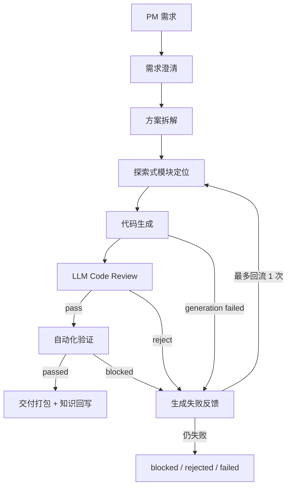

# P2.5 探索式动态边界与失败回流

## 背景

P2 的模块边界主要来自关键词评分和 LLM 选择，容易出现两类问题：

- 需求涉及路由、组件、服务、后端接口的调用链时，只命中局部文件，遗漏入口文件或被调用模块。
- patch、review、build 失败后只做 patch repair，没有把失败信息回流到模块定位阶段，导致多次生成稳定复现同一类错误。

P2.5 的目标不是继续堆具体需求规则，而是让流程具备通用的“探索 - 修改 - 验证 - 回流”闭环。

## 工作流

## 探索式边界

模块定位不再只依赖关键词 Top N，而是组合三类信号：

- 关键词候选：基于需求词、领域词、文件路径、文件内容进行初筛。
- 依赖探索：从候选文件出发，解析 `import` 和 `require`，补充直接依赖与直接反向引用文件。
- 结构入口探索：识别 `main`、`App`、`routes`、`router`、`index` 等入口/注册文件，只要它们引用候选模块或需求关键词，就纳入上下文。

输出仍然分为：

- `editBoundary`：允许修改的源码文件。
- `readOnlyFiles`：只读上下文，用于减少模型发明不存在的 import、service、helper。
- `exploration`：记录每个探索补充文件的来源原因，便于审计。

## 失败回流

workflow 最多执行两轮实现尝试：

1. 第一轮按探索式边界生成代码。
2. 如果代码生成失败、LLM review reject、或 verification blocked，将失败信息结构化为 feedback。
3. 第二轮模块定位会把 feedback 和原需求一起作为输入，扩大候选范围，并把失败文件、build/test 错误、review required changes 纳入上下文。

当前 feedback 类型：

- `code_generation_failed`
- `code_review_reject`
- `verification_blocked`

## 交付门禁

P2.5 明确区分“生成成功”和“可提测”：

- LLM review reject：`rejected_by_code_review`
- test/build/smoke 任一失败：`blocked_by_verification`
- 只有 review pass 且 verification 全部通过：`completed_with_gates`

## 当前限制

- 回流次数当前限制为 1 次，避免模型在同一 run 内无限循环。
- 失败回流目前不会重置 worktree，而是在当前变更基础上修复。后续可以升级为每轮独立 patch stack 或 worktree snapshot。
- 探索器目前解析 JS/JSX 的静态 import/require，对动态 import、运行时路由注册、后端中间件链路的理解仍需增强。
