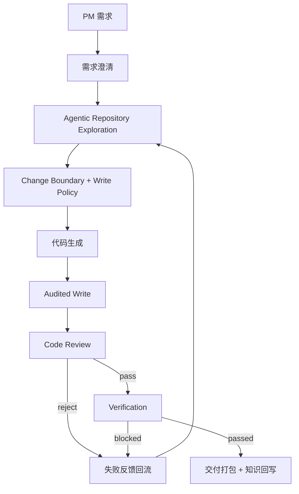

# P3 Agentic Repository Exploration + Audited Write Policy

## 目标

P2.5 解决了“关键词边界 + patch 失败”的问题，但仍然偏向先确定少量 `editBoundary`。P3 的目标是更接近 Claude Code 式工作方式：

- 先探索仓库，再决定修改策略。
- 不把模型硬限制在少数文件中。
- 允许在源码区内按需修改，但所有实际写入都要审计。
- 危险目录和配置文件继续硬禁止。

## 工作流

## Agentic Repository Exploration

探索阶段现在不只使用关键词 Top N，还会让模型基于仓库地图输出：

- `filesToInspect`: 应继续阅读的上下文文件。
- `writeCandidates`: 可能需要修改的文件。
- `searchTerms`: 后续检索线索。
- `rationale`: 探索理由。

系统再结合静态依赖图做补充：

- `import`
- `export ... from`
- `require`
- 直接依赖与反向引用
- 入口文件，如 `main.jsx`、`App.jsx`、`index.js`

## Audited Write Policy

P3 不再把 `editBoundary` 当作唯一可写集合，而是采用分层策略：

- 建议优先修改：`editBoundary`
- 可审计源码区：`frontend/src/`、`backend/`
- 硬禁止：
  - `node_modules`
  - `dist/build`
  - `package.json`
  - `package-lock.json`
  - `.env`
  - `backend/migrations`
  - `backend/seeders`

每个实际 touched file 都会生成 `writeAudit`：

- `planned_edit_boundary`
- `promoted_from_read_context`
- `audited_source_expansion`
- `outside_initial_boundary`

只要文件不在初始建议边界内，报告会标记为“需关注”，并交给 code review 判断必要性。

## 失败回流

代码生成失败、LLM review reject、verification blocked 会生成结构化 feedback，并回流到下一轮探索和生成。当前最多 3 轮，避免无限循环。

## 和 Claude Code 的差异

P3 仍不是完全自由的本地 coding agent。它更像可审计的交付 agent：

- 可以比 P2.5 更自由地修改源码区。
- 仍通过 hard block 防止危险改动。
- 所有越过建议边界的改动必须出现在报告和 review 中。

下一步如果继续增强，应加入真实工具循环：模型可以多轮发起 `search/read` 动作，而不是一次性吃仓库地图。
