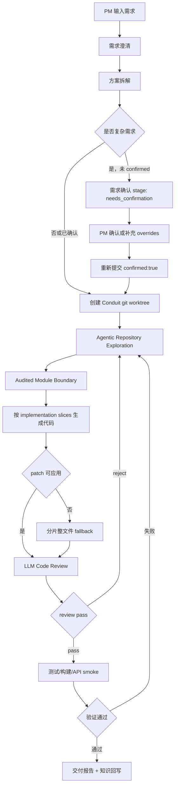

# P4：交互确认与长链路代码生成

## 背景

复杂 PM 需求通常不是单文件修改，而是跨越数据模型、API contract、前端表单、服务层、列表展示、详情页展示和验证链路。此前流程虽然已经具备动态边界和审计写入策略，但在“文章加封面图字段”这类长链路需求上暴露两个问题：

- 需求没有正式确认节点，模型会直接进入代码生成，关键假设无法被 PM 修订。
- 一次性生成大 patch 时容易出现 diff hunk 不稳定；整文件 fallback 又一次性要求模型返回多文件，结果可能返回空文件集合。

## 新流程



## 需求确认节点

复杂需求默认先返回 `needs_confirmation`，不创建 Conduit worktree，也不写目标仓库。返回内容包括：

- 结构化后的需求标题、用户故事、验收标准、开放问题。
- 本次建议的 implementation slices。
- 工具侧假设，例如只做 Conduit 增量改动、禁止修改环境文件和依赖锁文件。
- 给 PM 的确认问题：验收标准是否准确、开放问题如何回答、是否允许修改共享模块。
- 下一步 API 操作：`POST /api/workflows/:runId/confirm`，携带用户输入的 `confirmationOverrides`。

示例：

```json
{
  "confirmationOverrides": {
    "freeText": "请按默认实现范围执行；不要修改共享错误类；本期不做额外上传能力。",
    "acceptanceCriteria": [
      "新增字段为可选项",
      "旧数据缺少该字段时页面不报错",
      "新建和编辑流程均可保存并回显该字段"
    ],
    "outOfScope": [
      "本期不做本地图片上传"
    ]
  }
}
```

兼容直接重新提交：

```json
{
  "requirement": "原始 PM 需求",
  "confirmed": true,
  "confirmationOverrides": {
    "freeText": "PM 对开放问题的回答"
  }
}
```

## 长链路分片

`solution_planning` 会生成 `implementationSlices`。对于封面图需求，典型分片是：

- `backend-data-model`：Article 模型字段和兼容旧数据。
- `backend-api-contract`：创建、编辑、详情、列表接口的入参/出参。
- `frontend-editor-flow`：新建/编辑表单输入 URL，并提交 payload。
- `frontend-list-rendering`：列表卡片展示封面图或空态。
- `frontend-detail-rendering`：详情页展示封面图。
- `verification-and-review`：测试、构建、API smoke、LLM review。

这些 slices 会进入代码生成 prompt。patch 失败后，fallback 不再一次性要求模型重写所有文件，而是逐 slice 请求整文件写入，并在每个 slice 后把文件写回 worktree。后续 slice 读取的是已经被前序 slice 修改后的当前文件内容。

## 写入策略

P4 沿用 P3 的 Audited Write Policy：

- 可以修改 `frontend/src/` 和 `backend/` 下源码。
- 禁止修改 `node_modules`、构建产物、`package.json`、lockfile、`.env`、`backend/migrations`、`backend/seeders`。
- 超出初始模块边界但位于允许源码根内的文件会被标记为 `audited_source_expansion`，在交付报告中提示人工关注。

## 验收方式

每次 run 完成后，报告仍会输出：

- 本次变更文件。
- 写入审计结果。
- LLM Code Review 的 pass/reject 结论。
- 自动验证结果。
- 本次人工验收建议。

LLM review 使用一票否决策略：如果模型在 `risks` 或 `suggestions` 中提到破坏原有交互、回归、不符合产品逻辑、必须恢复/移除某段行为，即使它误判 `verdict=pass`，工具侧也会归一化为 `reject` 并进入失败回流。

在 LLM review 前还会执行确定性检查：

- 后端变更文件执行 `node --check`，提前发现语法错误。
- CommonJS 模块不得丢失原有导出，避免 controller/service 被截断后仍进入后续流程。
- React 组件不得删除原有 props，调用方不得传入组件未支持的 props，避免共享组件 API 回归。

需求相关的边界输入不再硬编码。验证阶段会让 LLM 根据需求和 diff 生成最多 2 个后端 smoke probe，例如长文本、长 URL、空值、重复值、权限、旧数据兼容等；工具只提供安全执行框架、占位符数据和本地 API 调用能力。

对于封面图需求，人工验收建议至少包括：

1. 启动 Conduit。
2. 新建文章，填写封面图 URL。
3. 检查列表卡片展示封面图。
4. 进入详情页检查封面图展示。
5. 编辑文章修改封面图 URL，保存后重新打开确认回显。
